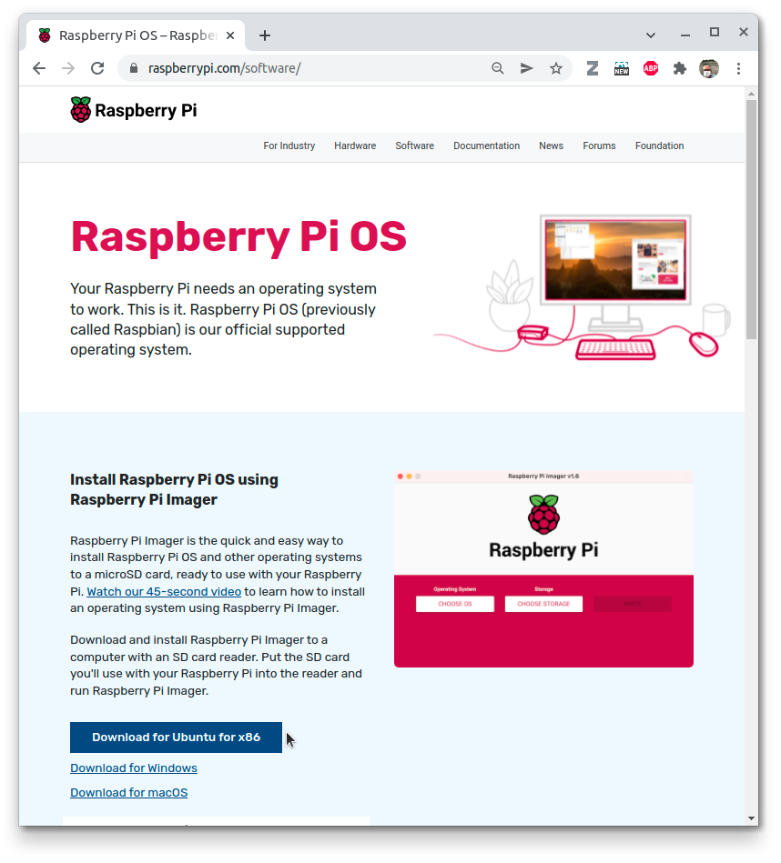
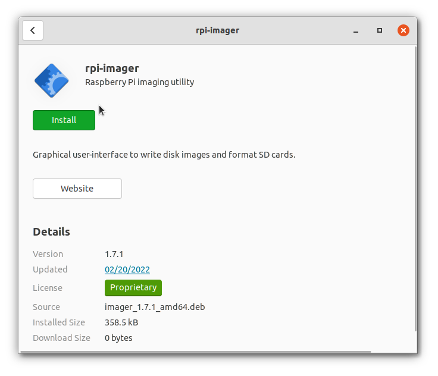

# Læg et image af Raspberry Pi OS på sd-kort

Denne opskrift viser hvordan man lægger et _Raspberry Pi OS Lite_ image på et sd-kort, og sætter det op til at starte "headless". I denne sammenhæng er "headless" at starte Raspberry Pi'en op, uden skærm, men tilsluttet wifi, så man kan (fjern)styre den, fra en anden computer med __`ssh`__.

Vi bruger __Raspberry Pi OS Lite (64-bit)__, som debian linux. porteret til Raspberry Pi ARM processor.  


"__Lite__" er _uden_ GUI (X-windows).

Til at skrive imaget til sd-kortet bruger vi Rasperry Pi's ejet program __`rpi-imager`__.  
Imager tilføjer nogle indstilliger på sd-kortet, efter imaget er skrevet ned på det. Derfor skal __`rpi-imager`__ køres som root, så programmet  får fuld adgang til de nyskrevne partitioner, på sd-kortet.

## Opskrift

1.  Download Imager, som .deb-fil  
    

1.  Installer Imager
    * Chrome  
    klik på den downloadede fil...  
    
    * Firefox  
        * gem filen
        * åbne file, og dbl-klik på den gemte fil


2.  Klik __Install__  
    

3.  start _Imager_ __som root__ med
    ```bash
     sudo rpi-imager
    ```
    
4.  Tryk på: _CHOOSE OS_:  
5.  Vælg _Raspberry PI OS (other)_:  
    
6.  Vælg _Raspberry Pi OS Lite (64-bit)_:  
    
7.  Vælg _Mass Storage_Device - 31.3 GB_: (eller hvad der dukker frem, og ligner et sd-kort på ca 32GB)  
    
8.  Tryk nu på Tandhjulet:  
     
9.  Vælg:
    * [x] _Set hostname:_ noget med dine initialer
    * [x] _Enable SSH_ og
      * [x] _Use password authentication_  
      
    og scoll ned:
10. vælg også:
    * [x] _Set username and password:_ 
      * [x] _Username:_ __`pi`__ er fint
      * [x] _Password:_ find på noget godt, __og skriv det ned! Ellers er du fu****!__
    
11. og ...
    * [x] Configure wifi
      * [x] _SSID:_ __`LinEmb`__
      * [x] _Password_: __`28368557`__ 
      * _wifi country_: __`DK`__  
    
12. og ... til sidst:
    * [x] _Set locale settings_:
        * _Time zone:_ __`Europe/Copenhagen`__
        * _Keyboard layout:_ lige meget, vi sætter helst ikke keyboard til...  
    
13. Tryk på _SAVE_  
    
14. Tryk på _WRITE_  
    
15. Tryk på _YES_, for at slette sd-kortet ... (håber du har valgt det rigtige... ;-) )
    
16. Vente, vente, vente ...   
    
17. Færdig!
    * skub sdkortet ud (unmount)
    * træk kortlæseren ud, fysisk.
    * sørg for at strømmen på "din" Raspberry Pi er ude
    * sæt sd-kortet i Raspberry Pi'en
    * sæt strøm til Raspberry Pi'en
    * vent lidt...  
    

18. Tilslut til "din" RaspberryPi med kommandoen:
    ```bash
    ssh pi@smagpi.local
    ```

    Det virker hvis du skriver brugernavnet (fra ovenfor) foran `@`'et, bruger hostnavnet (også fra ovenfor) efter `@`'et, og `.local` efter hostnavnet. 

    


