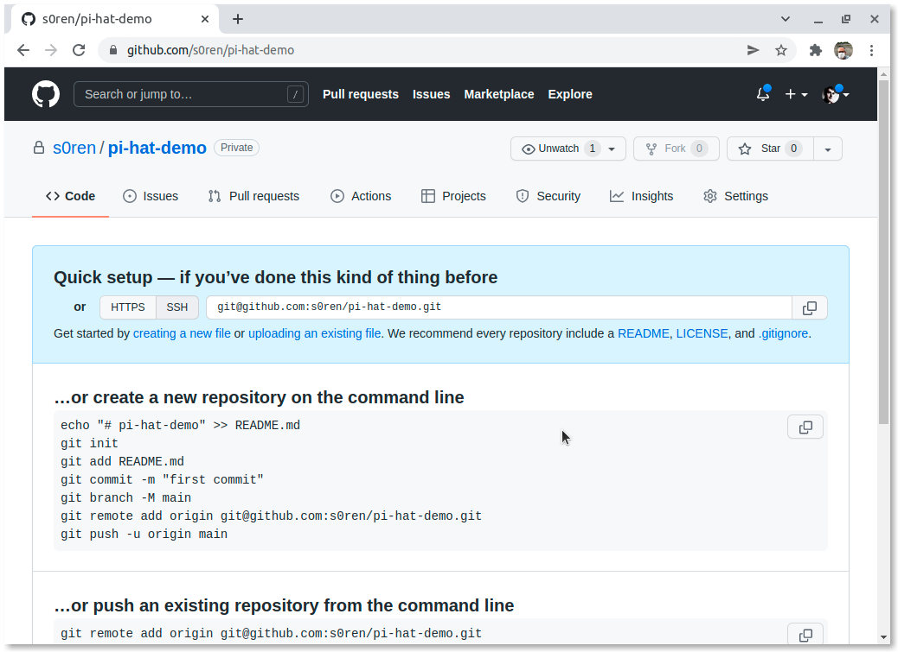
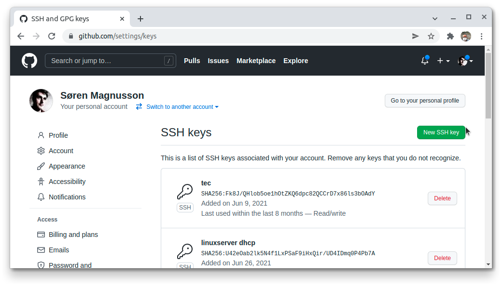
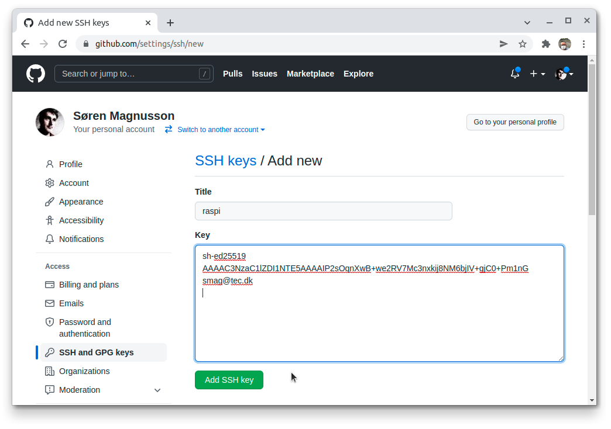
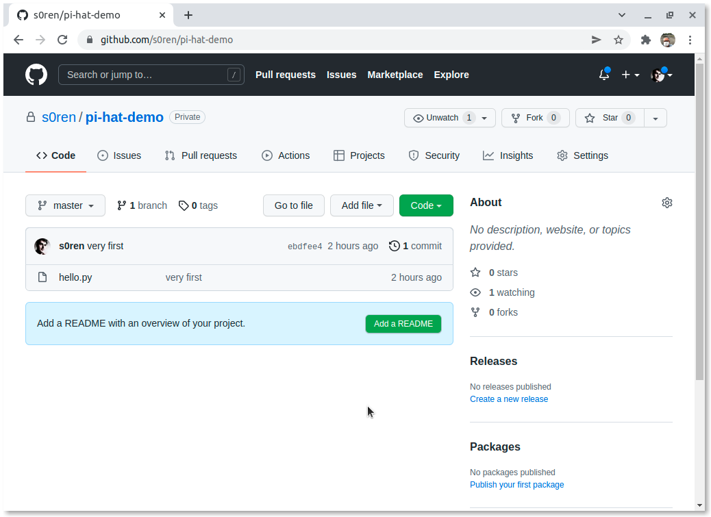

# Sådan bruger man SSH med certifikat til GitHub

## Problem
Jeg har lavet et projekt på github som er tomt...



Men jeg kan ikke _Clone_ projektet fordi jeg ikke må logge ind:

```bash
$ git clone https://github.com/s0ren/pi-hat-demo.git
```
    Cloning into 'pi-hat-demo'...
    Username for 'https://github.com': s0ren
    Password for 'https://s0ren@github.com': 
    remote: Support for password authentication was removed on August 13, 2021. Please use a personal access token instead.
    remote: Please see https://github.blog/2020-12-15-token-authentication-requirements-for-git-operations/ for more information.
    fatal: Authentication failed for 'https://github.com/s0ren/pi-hat-demo.git/'

Desværre er "personal access token" ikke rigtigt muligt.

## Løsning 1

Så jeg prøver med `SSH`:

```bash
$ git clone git@github.com:s0ren/pi-hat-demo.git
```
    Cloning into 'pi-hat-demo'...
    git@github.com: Permission denied (publickey).
    fatal: Could not read from remote repository.

    Please make sure you have the correct access rights
    and the repository exists.

Men det fejler fordi _GitHub_ ikke tillader `SSH` med password. Kun med _publickey_, som man også kan læse i fejlmeddelselsen.  
Lidt kryptisk, måske, betyder det at _(publickey)_ er den eneste måde der tilbydes, og da jeg ikke har en _publickey_ (endnu), kan jeg ikke logge ind på _GitHub_ med den metode. 

## Løsning 2

Prøver med `SSH` __og__ _certifikat_:

Baseret på <https://docs.github.com/articles/generating-an-ssh-key/>

1.  Lav certifikat  
    Jeg laver et certifikat, på Raspberry Pi, som jeg kan bruge til at logge ind på GitHub: 

    ```bash
    $ ssh-keygen -t ed25519 -C "smag@tec.dk"
    ```

        Generating public/private ed25519 key pair.
        Enter file in which to save the key (/home/pi/.ssh/id_ed25519): 
        Created directory '/home/pi/.ssh'.
        Enter passphrase (empty for no passphrase): 
        Enter same passphrase again: 
        Your identification has been saved in /home/pi/.ssh/id_ed25519
        Your public key has been saved in /home/pi/.ssh/id_ed25519.pub
        The key fingerprint is:
        SHA256:uHOjLl0eOSXmovFZQtnBpBMpITmtbnIdfgStj9QwN4U smag@tec.dk
        The key's randomart image is:
        +--[ED25519 256]--+
        |  .o.o.*o        |
        |  o.* Eoo        |
        |   o Oo+ .       |
        |  . + =o+ .      |
        | . + *.oS+       |
        |. + = =.B        |
        | +   *oBoo       |
        |    o ++..       |
        |     oo          |
        +----[SHA256]-----+

    Jeg kan se to nye filer med `ls -la`:

    ```bash
    $ ls -la .ssh/
    ```
        total 20
        drwx------ 2 pi pi 4096 Feb 22 13:41 .
        drwxr-xr-x 8 pi pi 4096 Feb 22 13:41 ..
        -rw------- 1 pi pi  399 Feb 22 13:37 id_ed25519
        -rw-r--r-- 1 pi pi   93 Feb 22 13:37 id_ed25519.pub
        -rw-r--r-- 1 pi pi  666 Feb 22 13:44 known_hosts

    De nye filer er: `id_ed25519` og `id_ed25519.pub`.  
    `id_ed25519` er den private nøglefil. Den skal jeg __*aldrig*__ dele med andre!  
    `id_ed25519.pub` er min public nøglefil. Den skal jeg dele med GitHub. 

    Fordi SSH bruger mit public/private nøglepar, og krypterer med den private nøgle, kan dat kun afkrypteres med den offentlige nølge. På den måde kan det verificeres at data'erne kommer fra mig.  
    Da `SSH` også bruger _GitHubs_ _public key_, kan dataerne kun udpakkes med deres offentlige nøgle.  
    Der er altså tale om kryptering med et dobbelt (pub/priv) nøglepar. Dermed er det sikret båre at data kommer fra afsenderen, og at de kun kan læses af den ønskede modtager. I praksis er det naturligvis dem som er besidelse af nøgle-filerne, som kan kryptere og afkryptere, med dem. Så snyd er muligt.


2.  Overfør den __*offentlige*__ nøgle til GitHub  (den der slutter på `.pub`)  
    På <https://github.com/settings/keys> trykker jeg på _New SSH key_  
    
    

    1. Vis den offentlige nøgle i den offentlige nøgle-fil: `.ssh/id_ed25519.pub`
        ```bash 
        $ cat .ssh/id_ed25519.pub 
        ```   
            ssh-ed25519 AAAAC3NzaC1lZDI1NTE5AAAAIP2sOqnXwB+we2RV7Mc3nxkij8NM6bjIV+gjC0+Pm1nG smag@tec.dk

    2. Marker hele linien ovenfor (på din terminal, ikke her, :-O) og kopier ved at taste __`Ctrl-Shift-c`__
    
    3. Indsæt nu i feltet key:

        

        Skriv også et navn til nøglen. F.eks. raspi.

    4. Tryk på _Add SSH key_

3. Nu kan jeg _Clone_
    ```bash
    $ git clone git@github.com:s0ren/pi-hat-demo.git
    ```
        Cloning into 'pi-hat-demo'...
        The authenticity of host 'github.com (140.82.121.4)' can't be established.
        ECDSA key fingerprint is SHA256:p2QAMXNIC1TJYWeIOttrVc98/R1BUFWu3/LiyKgUfQM.
        Are you sure you want to continue connecting (yes/no/[fingerprint])? yes
        Warning: Permanently added 'github.com,140.82.121.4' (ECDSA) to the list of known hosts.
        warning: You appear to have cloned an empty repository.

4. OSV

    * Kopier en fil ind i projektet  
        ```bash
        $ cp demo/hello.py pi-hat-demo/
        ```

    * Stage filen
        ```bash
        $ git add hello.py 
        ```
    * Commit filen
        ```bash
        $ git commit . -m "very first"
        ```
            [master (root-commit) ebdfee4] very first
            1 file changed, 6 insertions(+)
            create mode 100644 hello.py
        
    * Push filen
        ```bash
        $ git push origin master
        ```
            Warning: Permanently added the ECDSA host key for IP address '140.82.121.3' to the list of known hosts.
            Enumerating objects: 3, done.
            Counting objects: 100% (3/3), done.
            Delta compression using up to 4 threads
            Compressing objects: 100% (2/2), done.
            Writing objects: 100% (3/3), 310 bytes | 155.00 KiB/s, done.
            Total 3 (delta 0), reused 0 (delta 0), pack-reused 0
            To github.com:s0ren/pi-hat-demo.git
            * [new branch]      master -> master

Det virker!

