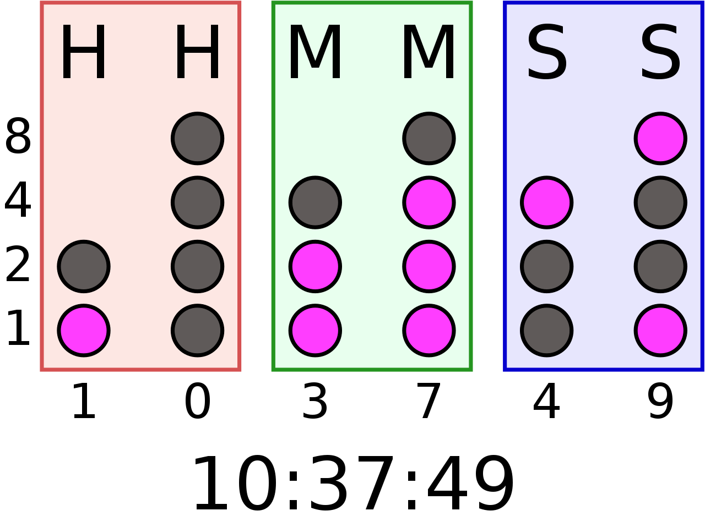

# Mål fra bekendtgøreselsen:
Egentlig hedder det Uddannelsesordning og adminstrerres af IndustriensUddannelser for Det Faglige Udvalg og Undervisningsministeriet.  
Se <https://iu.dk/uddannelser/erhvervsuddannelser/erhvervsuddannelser-og-specialer/data-og-kommunikationsuddannelsen/>, <> og især <https://iu.dk/media/3035/undervisningsvejledning-til-data-og-kommunikationsuddannelsen.pdf>, som jeghar sakset side 15 fra herunder:

`8<`

---

## Linux rettet mod server og embedded v. 1,0 
Nummer: 16481-2 
Varighed: 5 dage. 
 
### Målpinde: 
 
1. Eleven har en generel viden om Linux miljøet, og kan anvende denne viden i  forbindelse med opgaver rettet mod Linux baserede systemer. 
2. Eleven kan navigere i et Linux shell miljø og anvende almindeligt forekommende Linux kommandoer. 
3. Eleven har en grundlæggende viden om Linux distributioner og Linux open source  miljøet. 
4. Eleven har en grundlæggende viden om Linux opbygning og Linux kernen. 
5. Eleven kan anvende Linux programmeringsmiljøet. 
6. Eleven kan anvende værktøjer og programmeringsmodellen til Linux. 
7. Eleven kan anvende programmeringsmodellen til forskellige Linux varianter, herunder Linux server og embedded Linux. 
8. Eleven kan anvende Linux dokumentationen til selvstændigt at finde nødvendig information. 
9. Eleven kan dokumentere egne løsninger i Linux dokumentationssystemet. 
 
### Vejledning: 

Overvejelser om faget. 

* Faget bør lægges tidligt i forløbet, så eleverne har mulighed for at arbejde på både Linux og Windows platformen.  
* Tanken bag dette fag er at eleven får kendskab til Linux programmerings miljøet og kan anvende denne viden i forskellige sammenhænge hvor Linux anvendes. For eksempel til Server eller embeddede Linux systemer. 
* Dette fag ligger på H5 og vi formoder at eleven har haft alle fastlagte programmeringsfag til og med H4. 
* Vi har lagt vægt på der ikke er nævnt specifikke programmeringssprog eller metoder. 
* Programmering af Linux drivere og programmering til kernekald er næsten helt uafhængig af valg af programmeringssprog.

---
`8<` slut

## Spørgsmål:

- Hvordan opnår man viden om "Linux kernen", på et uges kursus?
- Hvad er "rogrammeringsmodellen til Linux"?  
  I betemt ental!
- Hvad er "Linux dokumentationssystemet"?  
  Også er bestemt ental!
- Drivere?!

# min omsættelse til rimelige og lærerige mål

* Lær at installere programmer og kode-biblioteker med Linux pakke-manager
* Lær at lave et programe der afviklet i et linux miljø.
  * Lær om det spidsfindigheder der hører til dette
    * she-bang linie `#!`
    * brug chmod til at gøre programmet eksekverbart
    * Håndter SIG TERM
    * Undgå bussy waiting, med bedre timer mekanik (øh, det bør man nok på alle platforme :)
  * Lær om at sætte programmeringsmiljøet op i linux miljø
    * adgang via ssh
    * Brug af Make og Makefile
    * Git
    * afhængigheds og bibliteks-manager (pip, npm, maven, etc)
    * installation af programmer man self laver
  * ~~Lær at laven en linux-pakke, f.eks. en Debian (`.deb`) pakke.~~
  * Lær at sætte egne programmer op som service f.eks. `systemd unit`, så de starter når computeren starter. 
* Lær at håndtere autogenereret dokumentation, i samspil med egen dokumentation.
* Lær at lave man sider, og lægge dem ind i systemet.

# Konkrete opgaver
* Installer Ubuntu på din skole PC
  * Bare rolig, vi får rullet windows tilbage på dem igen :-)

* Lav et program på som implementerer _Det Binære Ur_.  
  Se <https://en.wikipedia.org/wiki/Binary_clock> og <https://magpi.raspberrypi.org/articles/binary-clock>
  * Programmet skal køre på den udleverede Raspberry Pi
  * Display
    * Det skal bruge LED'erne til at vise uret
    * Man skal kunne skifte mellem lodret visning i seks søjler og vandret visning i tre rækker. Se 6 søjler lodret [6 lodret](https://en.wikipedia.org/wiki/Binary_clock#/media/File:Digital-BCD-clock.jpg) og tre rækker vandret [3 vandret](https://en.wikipedia.org/wiki/Binary_clock#/media/File:Binary_clock_Swiss_railway_station.jpg) 
    * Man skal også kunne skifte mellem 12-timers og 24-timers visning
  * User interface
    * Man skal kunne vælge mellem lodret/vandret visning OG 12/24 timer, 
      - både ved programstart, ved at håndtere såkaldte kommandolineparametre, 
      - og med at bruge mini-joysticket på SenseHat'en. 
  - Programmet skal vise tiden så uret skifter hvert sekund.
    - Når programmet starter skal det udskrive teksten _"Programmet starter"_ på SenseHat'ens LED display.
    - Når det slutter skal det skrive "Programmet slutter" på SenseHat'ens LED display.
    - Programmet skal være optimeret i brugen af cpu-process-tid, således at det ikke bare kører en undelig løkke, men  bruger et timer-event-system.
    - Programmet skal også håndtere f.eks. control-c, så det afbryder på en kontrolleret måde.
  * Byg et program miljø med Make, pakke værktøjer og git, som "man gør" på linux.
    * I `Makefile`'en  skal der være targets
      * køre programmet (_run_)
      * afprøve (_test_) 
      * genrere dokumentation (_docs_)
      * installere (_install_)
      * alt ovenstående (_all_)  
      samt
      * afinstallere (_uninstall_)
      * rydde op (_clean_)
  * Lav semi automatisk dokumentation af programkoden med Docstrings og Doxygen (eller lignende)
    - Dokumentations Output skal både være html, pdf og man.
    - `man` siden skal være en detaljeret vejledning i kommandolinie parametrene til display-instillingerne, og en vejledning i hvordan man starter og stopper programmet som servic, og hvordan det "enables" som service. Dette skal også kunne læses på websiderne.
    - Se ekstra krav til menu-toppen af html-dokumentationen, nedenfor.
  * Programmet skal både kunne starte fra kommandolinien, og skal startes automatisk som en service, som _systemd unit_. 
  * Start og slut teksterne skal natruligvis også vises når service starter og stopper.  
    * _Ekstra spørgsmål_: Hvordan kan afprøve om sluttesksen bliver udskevet, når maskinen slukkes?
* _Ekstra-krav:_ Yderligere skal der oprettes og køres et rest-api (egentlig kun get), som aflæser luftfugtighed og temperatur fra SenseHat'en
  * Øverst i html-dokumentationens "header" skal teperatur og luftfigtig vises, således at det altid er en måling som er maks 3 sekunder gammel.  
  