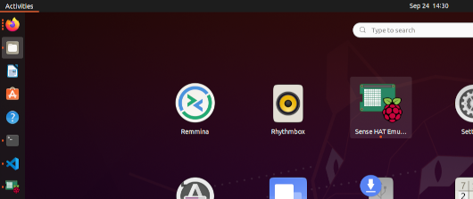
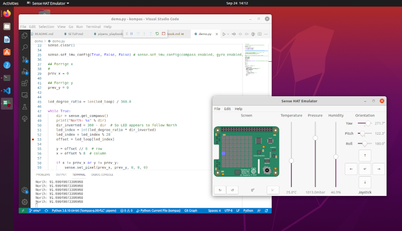

# Adventures using sense hat emulator

Se: <https://sense-emu.readthedocs.io/en/v1.1/index.html>

- [Adventures using sense hat emulator](#adventures-using-sense-hat-emulator)
  - [Installation](#installation)
    - [Løsning?](#løsning)
    - [Web udgave](#web-udgave)
  - [Første forsøg, med `demo.py`](#første-forsøg-med-demopy)
  - [Automatisk til og fra](#automatisk-til-og-fra)

## Installation

Jeg har valgt pipenv-installation, for at gøre installationen mest muligt reproducerbar. Derfor skal man installere nogen support moduler manuelt :-(

Se: <https://sense-emu.readthedocs.io/en/v1.1/install.html#alternate-platforms>

Dog har jeg også valgt pipenv, så min instgallations komando er:

    pipenv install sense-emu --dev

Jeg burde kunne starte gui'en på emulatoren, men der mangler noget:

```bash
    $ sense_emu_gui
    
    Traceback (most recent call last):
    File "/home/soren/.local/share/virtualenvs/kompas-pJXt-fLC/bin/sense_emu_gui", line 5, in <module>
        from sense_emu.gui import main
    File "/home/soren/.local/share/virtualenvs/kompas-pJXt-fLC/lib/python3.8/site-packages/sense_emu/gui.py", line 42, in <module>
        import gi
    ModuleNotFoundError: No module named 'gi'
```

I manualen står der at jeg skal bruge et gui-lib-modul `python3-gi`, så det prøver jeg:

```bash
    $ sudo apt install python3-gi
    [sudo] password for soren: 
    Reading package lists... Done
    Building dependency tree       
    Reading state information... Done
    python3-gi is already the newest version (3.36.0-1).
    python3-gi set to manually installed.
    The following packages were automatically installed and are no longer required:
    libpython2-stdlib libpython2.7-minimal libpython2.7-stdlib python2 python2-minimal python2.7 python2.7-minimal python3-appdirs python3-distlib python3-filelock
    python3-importlib-metadata python3-more-itertools python3-virtualenv python3-virtualenv-clone python3-zipp
    Use 'sudo apt autoremove' to remove them.
    0 upgraded, 0 newly installed, 0 to remove and 1 not upgraded.
```

Ikke så godt... at den ikke installerer noget. Det giver samme, _negative_, resultat at køre `sense_emu_gui` igen.


### Løsning?

Jeg kryber til korset og installerer de binære pakker:

    sudo apt install python-sense-emu python3-sense-emu sense-emu-tools


Jeg burde nok have udeladt python2 pakken (`python-sense-emu`):

    sudo apt install python3-sense-emu sense-emu-tools

### Web udgave

Der er også en browser udgave: <https://trinket.io/sense-hat>, men den kan ikke køre nær så smooth, med git osv.

## Første forsøg, med `demo.py`
Start SenseHAT Emulator (fram menu...):  


Start `demo.py` og træk i _Yaw_ for at kompas pixelsen flytte sig.  


## Automatisk til og fra

Det kan være fint at kunne sætte programmerne op at i bruge sense_emu i test, men den rigtige sense_hat i produktion.

Derfor har jeg oprettet filen `.env` i projektets rod. Når `pipenv shell` køres, indlæses linierne i `.env` som ekstra environment variabler fra operativsystemet. 

```bash
    $ pipenv shell
    Loading .env environment variables...
    Launching subshell in virtual environment...
```

I `demo.py` har jeg tilføjet/ændret import delen, så der nu står følgende, linje 6-12:

```python
    import sys
    from os import environ

    if 'EMU' in environ and environ['EMU']:
        from sense_emu import SenseHat
    else:
        from sense_hat import SenseHat
```

På den måde importeres `sense_emu` når environment-variblen `EMU` er sat til `True`, mens `sense_hat` importeres hvis `EMU` mangler eller er sat til noget andet (f.eks. sat til `False`).

